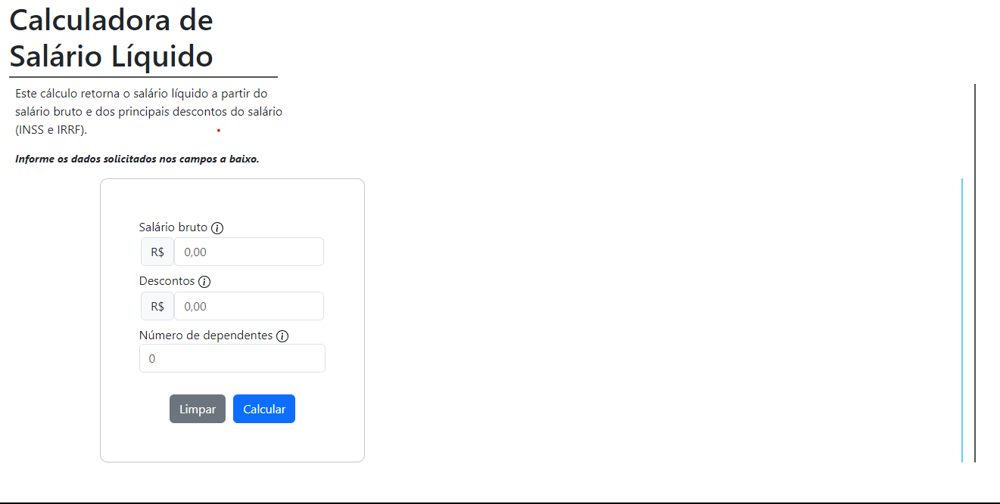
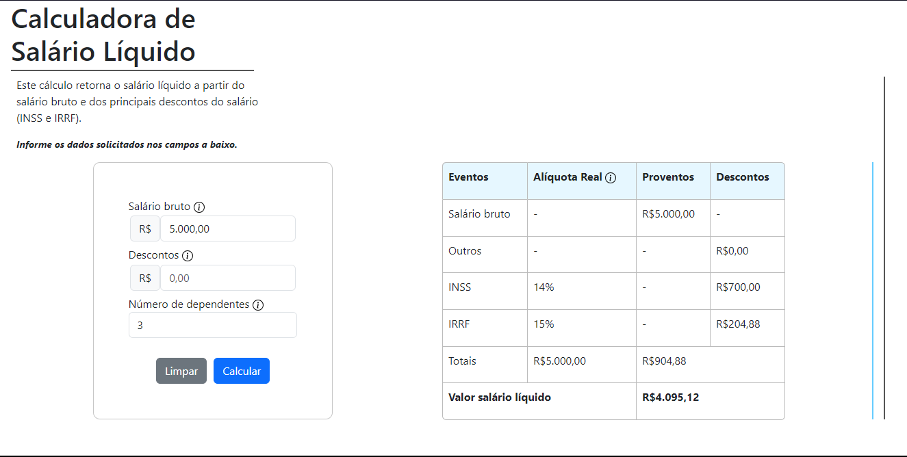

# Calculadora de Salário Líquido

This project was developed for an evaluative activity in the Information Systems course, as a project carried out in pairs. An interface was developed to receive user data 
entered in the form and display the details of discounts and totals in a table.
  Below are the project images.

## Technologies Used

         
         
        
        
        
        
    
  

## Collaborators

- <h4> Miriã Goncalves</h4> 🖇️https://github.com/miriarezende

- <h4> Augusto Kiichi </h4>  🖇️https://github.com/august0ka
